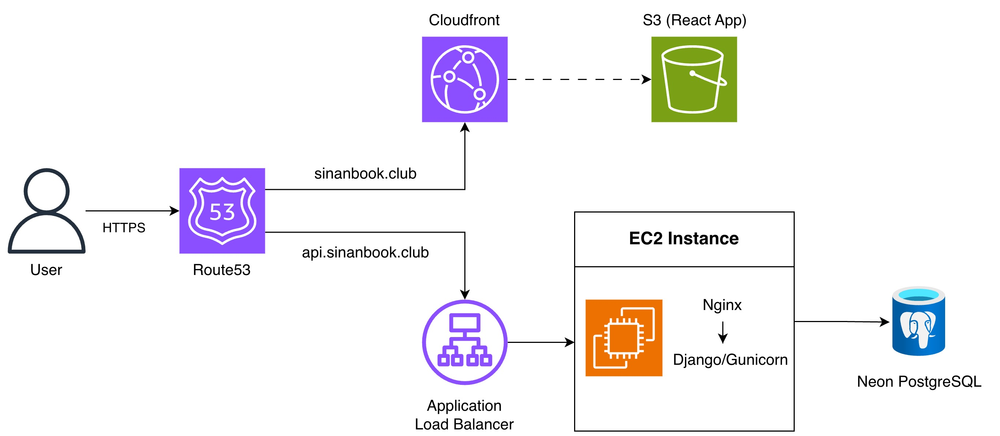
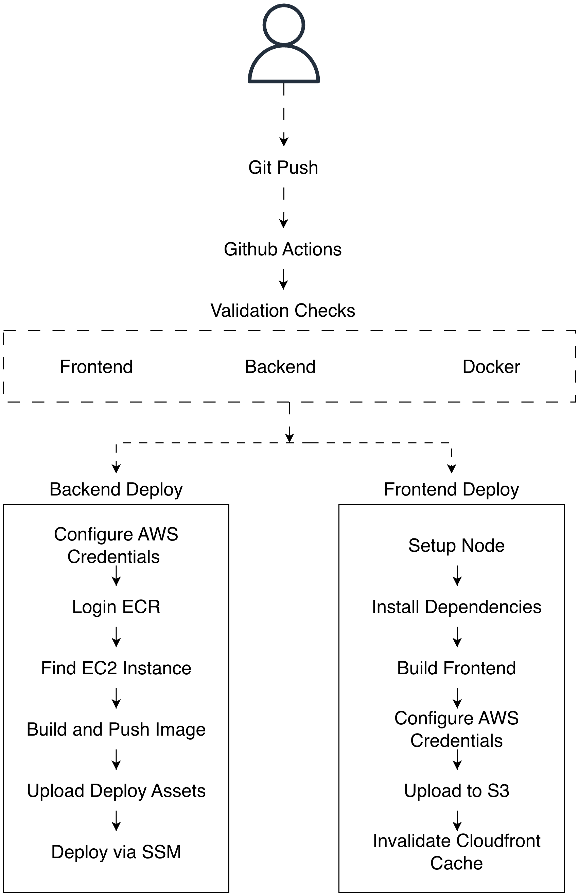

# BookClub

A full-stack cloud-native social platform for book enthusiasts, built with React, Django, Docker, Terraform, and AWS.

Bookclub is social platform where you can find your favourite books,genres and authors and also write reviews, create your own lists and check out other fellow book readers.
## Overview

BookClub allows users to discover books, authors, and genres, write reviews, create personalized reading lists, and explore recommendations from other readers.

The project originally started as my [CS50W Final Project](https://github.com/SinanErbezci/cs50w_final) and has since evolved into a production-style application with a React frontend, Django REST backend, and infrastructure fully managed with Terraform on AWS.

## Highlights

### Application

- 📚 Goodreads-inspired social platform
- 🔍 Advanced search and filtering capabilities
- ⭐ User reviews and custom reading lists
- 📖 Rich book, author, and genre pages
- 🎠 Responsive carousel-based browsing experience
- ⚡ Skeleton loading states and lazy data loading
- 📱 Responsive UI optimized for desktop and mobile

### Data

- 📥 Full ETL pipeline to import and normalize a large book dataset from CSV
- 🗄️ PostgreSQL database hosted on Neon

### Engineering

- ⚛️ React frontend with Django REST API backend
- ☁️ Infrastructure as Code with Terraform
- 🐳 Dockerized application with Docker Compose
- 🚀 Automated CI/CD pipeline using GitHub Actions
- 🔒 SSM-based deployments with no SSH access
- 🌐 AWS architecture using CloudFront, S3, and an Application Load Balancer
- 📊 Centralized container logging with CloudWatch
- 🔑 Secrets management with AWS Systems Manager Parameter Store
- 💰 Cost-optimized infrastructure using a custom AMI, VPC endpoints, and selective resource provisioning
## Live Demo

## Screenshots

## Features

## Tech Stack

## Architecture
BookClub follows a decoupled full-stack architecture with separate frontend and backend services. The React frontend is hosted on Amazon S3 and distributed globally through Amazon CloudFront, while the Django REST API runs inside Docker containers on Amazon EC2 behind an Application Load Balancer.

Domain routing is managed through Amazon Route 53, and application data is stored in a managed PostgreSQL database hosted on Neon.

## Infrastructure
All infrastructure is provisioned and managed through Terraform. The project evolved from a simple EC2 deployment to a production-style AWS environment featuring a custom VPC, centralized logging, automated deployments, secrets management, and immutable infrastructure practices.

### Custom VPC

The application is deployed inside a custom VPC rather than the default AWS VPC. The networking infrastructure is provisioned through Terraform and includes custom subnets, route tables, an internet gateway, and security groups.

The backend infrastructure is isolated behind an Application Load Balancer (ALB). The EC2 instance does not accept direct public traffic and is only accessible through security group rules that allow connections originating from the ALB.

Administrative access is provided through AWS Systems Manager (SSM) Session Manager instead of SSH. This eliminates the need to expose port 22 or manage SSH key pairs, reducing the attack surface while maintaining secure access for deployments and maintenance.

### Domain & DNS

A custom domain (`sinanbook.club`) was purchased from Namecheap and configured using Amazon Route 53. The application uses separate domains for the frontend and backend:

* `sinanbook.club` → React frontend hosted on Amazon S3 and distributed through CloudFront
* `api.sinanbook.club` → Django REST API served through an Application Load Balancer

DNS records are managed through Route 53, allowing traffic to be routed to the appropriate AWS services. TLS certificates are provisioned and managed through AWS Certificate Manager (ACM), enabling HTTPS for both frontend and backend services.

### Secrets Management

Production secrets and environment variables are stored in AWS Systems Manager Parameter Store rather than being committed to source control or stored directly on the EC2 instance.

During deployment, the EC2 instance retrieves encrypted parameters from Parameter Store and generates the runtime environment configuration required by the application. This approach centralizes secret management, simplifies credential rotation, and keeps sensitive information out of the codebase.

### Centralized Logging

Application and web server logs are centralized using Amazon CloudWatch Logs. Docker containers are configured with the `awslogs` logging driver, allowing Django and nginx logs to be streamed directly to CloudWatch.

Centralized logging simplifies troubleshooting and monitoring by providing a single location to inspect application behavior, deployment issues, and runtime errors without requiring direct access to the server.

### Golden AMI

A custom Amazon Machine Image (AMI) was created with Docker and Docker Compose pre-installed. New EC2 instances can be launched in a deployment-ready state without repeating the initial server bootstrap process.

Using a golden AMI reduces instance provisioning time, improves consistency between environments, and ensures that required dependencies are available immediately after launch.
### Terraform

All AWS infrastructure is provisioned and managed through Terraform. Networking, compute resources, DNS configuration, certificates, logging, container registry, and supporting AWS services are defined as code and version controlled alongside the application.

To further optimize costs during development, custom startup and shutdown scripts are included to automate the creation and removal of the most expensive infrastructure components when they are not needed. This allows the environment to be recreated on demand while minimizing ongoing AWS costs.

## CI/CD Pipeline
The project uses GitHub Actions to automate frontend and backend deployments. Every push triggers a validation stage that verifies the frontend, backend, and Docker configuration before deployment artifacts are built and published. Successful backend deployments build and publish a Docker image to Amazon ECR, while frontend deployments build the React application and publish static assets to Amazon S3, followed by a CloudFront cache invalidation.

## Future Roadmap

## Lessons Learned