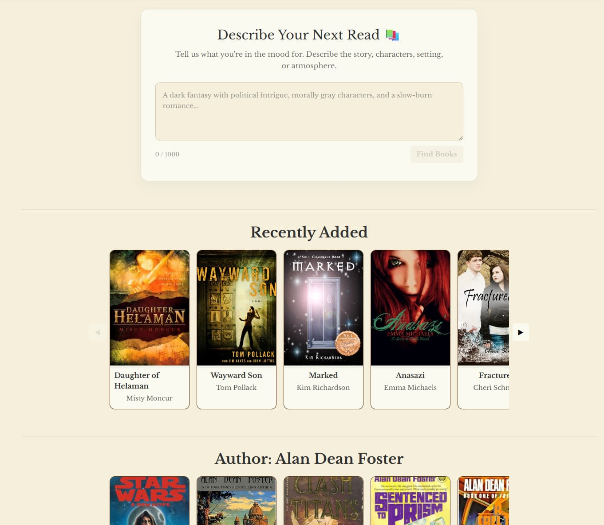
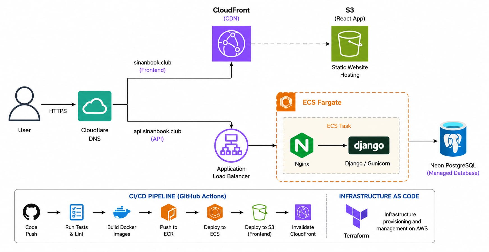
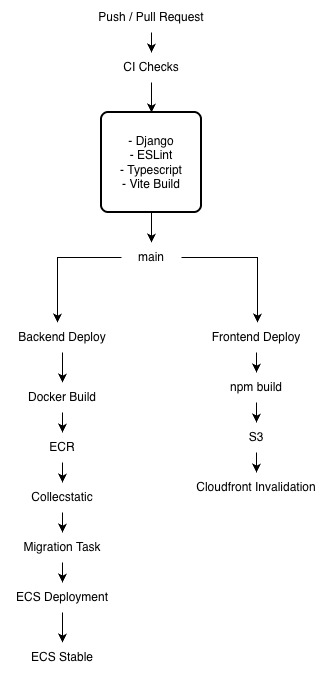
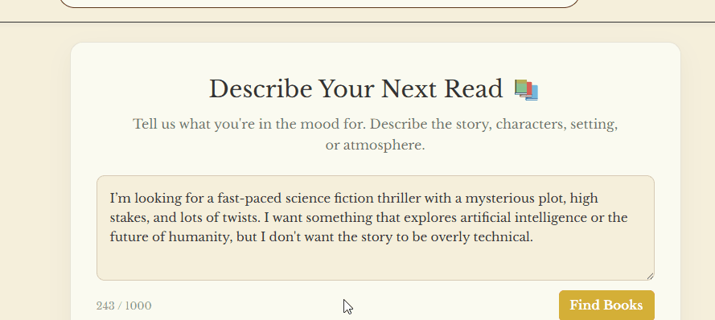

# BookClub


BookClub is a Goodreads-inspired web application for discovering, searching, reviewing, and organizing books.

It combines a Django REST API with a React/TypeScript frontend and includes semantic search, AI-powered recommendations, and LLM-generated explanations.

**Live Demo:** [bookclub.sinanerbezci.com](https://bookclub.sinanerbezci.com)

**API:** [api.sinanerbezci.com](https://api.sinanerbezci.com)

<p align="center">
  
</p>

## Overview

BookClub is a full-stack book discovery and review platform inspired by Goodreads, where users can create their own lists, write and read reviews, and use semantic search to find their next reads.

The backend is built with Django and Django REST Framework, while the frontend is built with React and TypeScript using Vite. PostgreSQL on Neon provides persistent storage, with PostgreSQL full-text search, trigram similarity, and vector search powering book discovery.

The application is deployed on AWS using Amazon ECS with Fargate, an Application Load Balancer, Amazon ECR, S3, and CloudFront. Infrastructure is managed with Terraform.

GitHub Actions provides the CI/CD pipeline, automatically validating the backend and frontend, building and publishing Docker images, collecting and deploying Django static files, running database migrations, deploying the backend to ECS, and deploying the frontend to S3 and invalidating the CloudFront cache.

The AI layer provides semantic search, book recommendations, AI-generated book summaries, and LLM-generated explanations for recommendations.

## Key Features

### Core Features

- Browse books, authors, genres, and series
- Search across books, authors, and genres
- View detailed book and author information
- Create and manage personal book lists
- Write, edit, and read book reviews
- Rate books
- User authentication and account management
- Discover recently added and randomly selected books

### AI & Search

- Semantic book search using vector embeddings
- Book recommendations based on book similarity
- AI-generated book summaries using the OpenAI Batch API
- LLM-generated explanations for book recommendations
- PostgreSQL full-text search and trigram similarity for traditional search
- Vector similarity search using PostgreSQL and pgvector

## Architecture

<p align="center">
  
</p>

<p align="center">
  
</p>

## AI Journey

The AI features in BookClub were developed incrementally, starting with experiments around text representation and summary generation and eventually becoming a pipeline for generating summaries, creating embeddings, performing semantic search, generating recommendations, and explaining those recommendations.

### 1. Semantic Summary Generation

We first experimented with LLM-generated book summaries. The goal was not simply to produce a shorter version of the plot, but to create a more semantic representation of the book that captures concepts such as themes, conflicts, world-building, important entities, and other characteristics that can be useful for understanding the book.

We iterated on the system prompt to influence the model toward this type of semantic summary rather than a straightforward plot explanation.

### 2. Embedding Input Experiments

Once we had generated summaries, we experimented with different representations as inputs to the embedding model.

We evaluated embeddings based on the original book description, the generated summary, and the generated summary without the title. The original descriptions often contained promotional or catalog-oriented text, while including the title could give the embedding an unnecessary influence from the book's name.

The production recommendation pipeline uses the generated summary without the title as its embedding input. Embeddings are generated using `BAAI/bge-small-en-v1.5`, producing 384-dimensional vectors.

### 3. Local Model Experiments with Ollama

We also experimented with running LLMs locally using Ollama. We tested Qwen3 4B and 8B models and benchmarked them against OpenAI's `gpt-4.1-mini`.

The local models produced good-quality summaries, making them useful for experimentation. On our NVIDIA GTX 1060, Qwen3 4B averaged 5.6 seconds per book, while the 8B model averaged 9.7 seconds per book.

The summary quality was good enough to make local inference a viable option for experimentation. However, generating summaries for the entire catalog would still take too long at this scale, so we chose the OpenAI Batch API for the full dataset.

### 4. Large-Scale Summary Generation with OpenAI Batch API

For generating summaries across the existing book catalog, we moved from individual API requests to the OpenAI Batch API using `gpt-4.1-mini`. The Batch API was a better fit for large-scale processing, offering a lower cost than standard API processing and allowing us to process the catalog asynchronously.

The Batch API has a limit of 2 million enqueued tokens. To handle this constraint, we implemented a token estimator using `tiktoken`. Rather than relying on the number of books in a batch, the exporter estimates the prompt-token usage of each request and builds batches up to a configured limit of 1.5 million tokens, leaving additional headroom below the API limit.

Depending on the token usage of the books in a batch, this typically resulted in around 2,500–3,000 books per batch.

The batch workflow exports requests, submits them to OpenAI, processes the resulting output files, and imports the generated summaries back into BookClub.

The complete summary-generation process took a little over two hours and cost approximately $8.60.


### 5. Semantic Search & Recommendations

#### Semantic Search

Users can describe the kind of book they are looking for using a natural-language query. The query is converted into an embedding using `BAAI/bge-small-en-v1.5`, and the system searches the book embeddings in PostgreSQL using cosine similarity to find the closest matches.

This allows users to search by concepts, themes, or characteristics rather than having to provide specific book titles or keywords.

<p align="center">
  
</p>

#### Book Recommendations

The same vector embeddings are used as the foundation for book recommendations. Starting from a selected book, the system retrieves books with similar embeddings and then applies additional filtering and ranking logic.

To avoid recommendations being dominated by books from the same series or author, the system limits the results to one book per series and one book per author. This produces a more diverse collection of recommendations while still maintaining semantic similarity.

### 6. LLM Recommendation Explanations

When a user clicks the explanation button for a recommendation, BookClub sends the summaries of the source book and recommended book to `gpt-4.1-mini` together with a system prompt designed to explain why the recommended book may be a good match.

The OpenAI request is made only when the explanation is requested. Generated explanations are cached, so subsequent requests for the same recommendation can use the stored result without making another API call.

<p align="center">
  
</p>

## Technology Stack

### Frontend

- React
- TypeScript
- Vite
- React Router
- Bootstrap
- Font Awesome

### Backend

- Python
- Django
- Django REST Framework
- Gunicorn
- WhiteNoise

### Database & Search

- PostgreSQL
- Neon
- pgvector
- PostgreSQL Full-Text Search
- PostgreSQL Trigram Similarity

### AI

- OpenAI `gpt-4.1-mini`
- OpenAI Batch API
- Ollama
- Qwen3 4B / 8B
- Sentence Transformers
- `BAAI/bge-small-en-v1.5`
- tiktoken

### Infrastructure & DevOps

- Amazon ECS / Fargate
- Application Load Balancer
- Amazon ECR
- Amazon S3
- Amazon CloudFront
- Amazon VPC
- AWS IAM
- AWS CloudWatch
- Terraform
- GitHub Actions
- Cloudflare
- Docker

## Infrastructure Lifecycle

The production AWS infrastructure can be enabled or disabled through Terraform using the `production_enabled` variable.

By default, production resources are disabled to avoid unnecessary AWS costs.

To create the production infrastructure:
```text
terraform apply -var="production_enabled=true"
        ↓
AWS infrastructure created
        ↓
GitHub Actions workflow
        ↓
Application deployed
```

And teardown:
```text
terraform apply -var="production_enabled=false"
        ↓
Production resources removed
```

## Future Roadmap

- Improve the recommendation system with additional signals and ranking strategies
- Expand AI-powered book discovery and personalization
- Experiment with additional embedding models and retrieval strategies
- Improve observability and monitoring across the production infrastructure
- Continue exploring AWS services and container orchestration